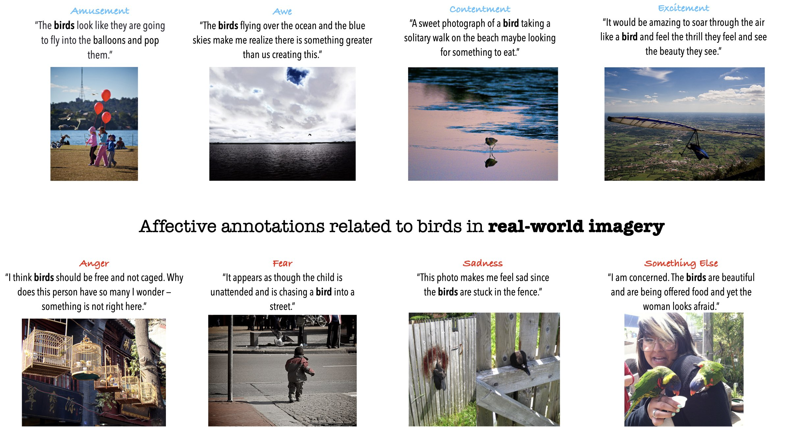

# Affection: Learning Affective Explanations for Real-World Visual Data


**Legal Disclaimer:** _The images shown above are included in the image-centric datasets covered by Affection (see below)._ **We do not have or claim any ownership or copyright right for these images.**

## Introduction

This codebase accompamnies our [CVPR-2023 paper](https://affective-explanations.org/). 

:exclamation: It is currently in its most <u>bare and bones</u> form allowing you to load and inspect the Affection data. For more code developments stay tuned.


## Installing this repo:

Optionally, first create a clean environment with pytorch installed. E.g., with [conda](https://docs.conda.io/en/latest/miniconda.html):
```
 conda create -n eeai python=3.8
 conda activate eeai
```

Then,
```
git clone https://github.com/optas/eeai.git
cd eeai
pip install -e .
```

For this _bare-and-bones_ repo version, the ```setup.py``` lists the few straightforward dependencies. Feel free to use any version of Python3.


## Downloading Affection's DATA

**The Affection dataset is provided under specific <a href="https://affectivetools.github.io/materials/affection_terms_of_use.pdf">terms of use</a>.  To download it please first fill this <a href="https://forms.gle/yTdgwHPwUC4a4C8Z8">form</a> accepting its terms.**

## Using Affection's DATA

1. For a detailed analysis of the content and structure of our annotations read this [readme file](./eeai/docs/Affection_Annotations.md).

2. You can use this [notebook](./eeai/notebooks/load_affection_annotations.ipynb) to load our annotations. _To visualize them you will need access to the image datasets Affection is built upon._ **First** read the above readme file, and then [this one](./eeai/docs/Affection_Images.md) for more information.


### Citation
If you find this work useful in your research, please consider citing:
	
	@article{achlioptas2023affection,
        title={{Affection}: Learning Affective Explanations for Real-World Visual Data},
        author={Achlioptas, Panos and Ovsjanikov, Maks and Guibas, Leonidas and
                Tulyakov, Sergey},
        journal = Conference on Computer Vision and Pattern Recognition (CVPR),
        year={2023}
    }
